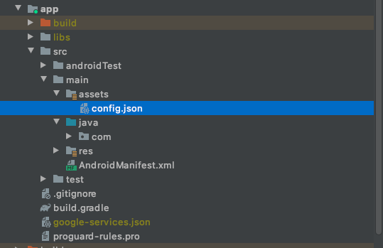
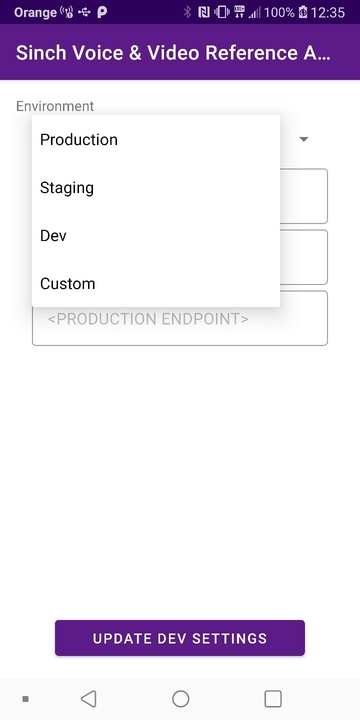

# RTC VVC Reference Application for Android

Reference Applications for the Android Client.

# Set up

#### 1. Download the SDK
Run `make sync` to fetch the Sinch Android Voice & Video SDK from the artifactory. This step is necessary now, because the SDK is not hosted on jCenter or mavenCentral, otherwise, gradle plugin will handle this.

#### 2. Create configuration file
To communicate with Sinch API you must include your application specific authorization settings. In order to do this, create a file called 'config.json' and place it inside assets folders of the application - (app/src/main/assets): 

.


Basic structure of the file looks as follows:

```json
{
  "name": "production",
  "appKey": "<PRODUCTION APP KEY>",
  "appSecret": "<PRODUCTION APP SECRET>",
  "environment": "<PRODUCTION ENDPOINT>"
}
```

Parameters description:

* name - Name of the environment as displayed in the settings screen.
* appKey - Application key copied from your Sinch portal webpage of the application.
* appSecret - Application secret copied from your Sinch portal webpage of the application.
* environment - Base URL used to make REST calls against Sinch API (E.g. ocra.api.sinch.com).

It possible to include as many environments as you wish (you will be able to switch between them from the settings screen of the sample):



To do this simply place a list of the environment objects in the 'config.json' file:

```json
[{
  "name": "Production",
  "appKey": "<PRODUCTION APP KEY>",
  "appSecret": "<PRODUCTION APP SECRET>",
  "environment": "<PRODUCTION ENDPOINT>"
},
{
  "name": "Staging",
  "appKey": "<STAGING APP KEY>",
  "appSecret": "<STAGING APP SECRET>",
  "environment": "<STAGING ENDPOINT>"
},
{
  "name": "Dev",
  "appKey": "<DEV APP KEY>",
  "appSecret": "<DEV APP SECRET>",
  "environment": "<DEV ENDPOINT>"
}]
```

#### 3. Add your google-services.json file

This sample uses Firebase Cloud Messaging for delivering push notifications.  
In order for push notification to work you must generate and include your application specific (with correspondent "package_name") google-services.json file.  
Instructions regarding creating the file are located at Firebase Manual website [here](https://firebase.google.com/docs/android/setup).  
For more information regarding Sinch Managed Push Notifications refer to Sinch Voice-Video calling documentation [here](https://developers.sinch.com/docs/voice-android-cloud-push-notifications#2-provision-the-application-with-the-support-code).

